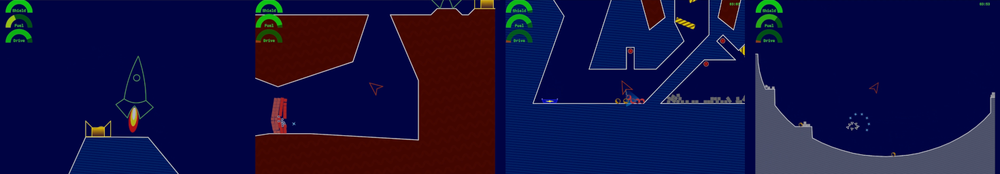
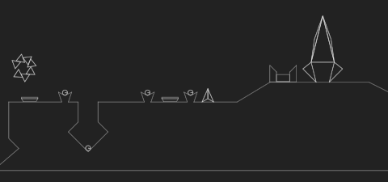
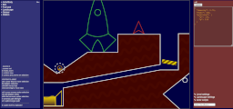

# Zzzone!

"In space, no one can hear you curse..."

A gravity game loosely based on the famous "Thrust" which I enjoyed as a teenager.
The goal is to place fuel pods into a collector so the rocket can lift off. The
game starts with two training sessions.

The game is alive at [https://www.engehausen.de/jan/zzz.html](https://www.engehausen.de/jan/zzz.html)

A longplay video with all levels successfully completed can be found at [https://youtu.be/tB0TSyMfM34](https://youtu.be/tB0TSyMfM34)

Action scenes:

Screenshots of all levels [here](screenshots/levels.png).

## Building the game

Make sure the dependencies are resolved by running `npm install`.
Then execute

	npm run build --production
	
to build the game. Open `src/index.html` in a browser; this will run the game.

## Running the game in debug mode

If you run just

	npm run build

and then open `src/index-dev.html` in a browser, the game will contain some additional debug code.
A level can be accessed with the prefix `d` and its code, for example: `file://...src/index-dev.html#d77564` - this will render the level _and_ its model. Pressing `d` removes the SVG layer, `e` removes the model layer.

Here's a screenshot of the planck model of a level, used for debugging:

## Building the editor

Yes, I created a level editor for myself. It is not very fancy, but it beats writing pure JSON.
I used it in combination with manual intervention to create the levels.
If you want to have a look, set the environment variable `EDITOR=y` and run

	npm run build

Open `src/index-dev.html` in a browser. This will show the editor. Here's a screenshot:

[Full size image](screenshots/editor.png)
